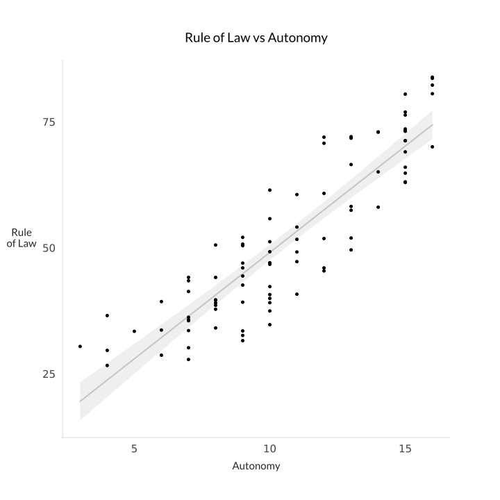
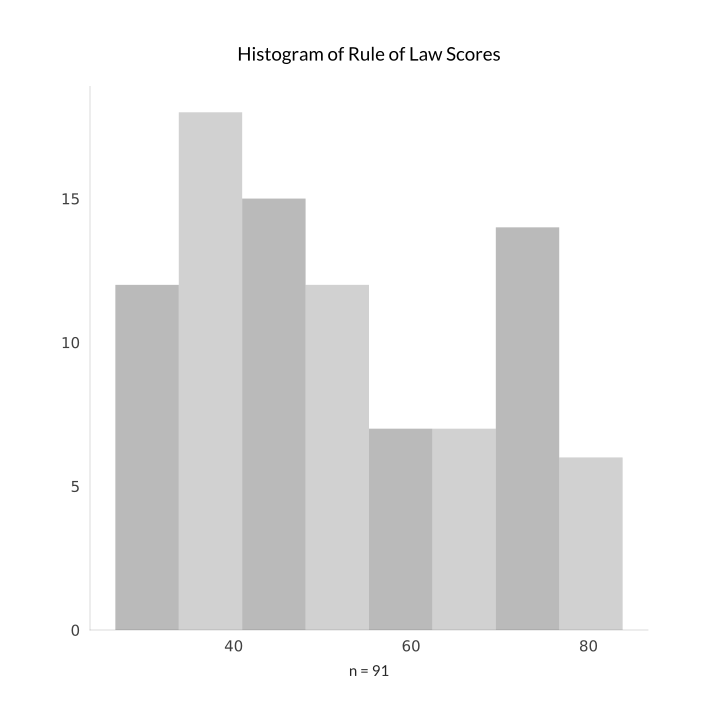
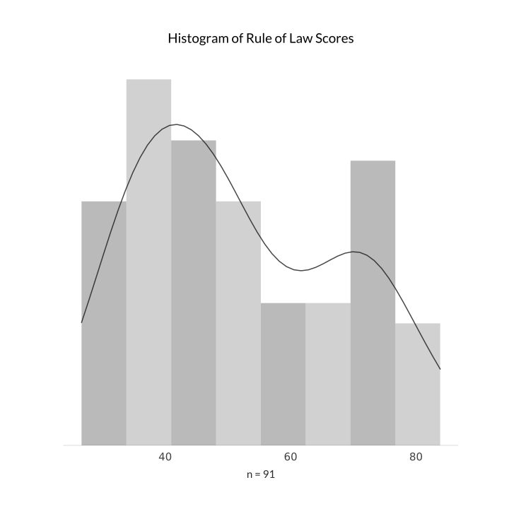
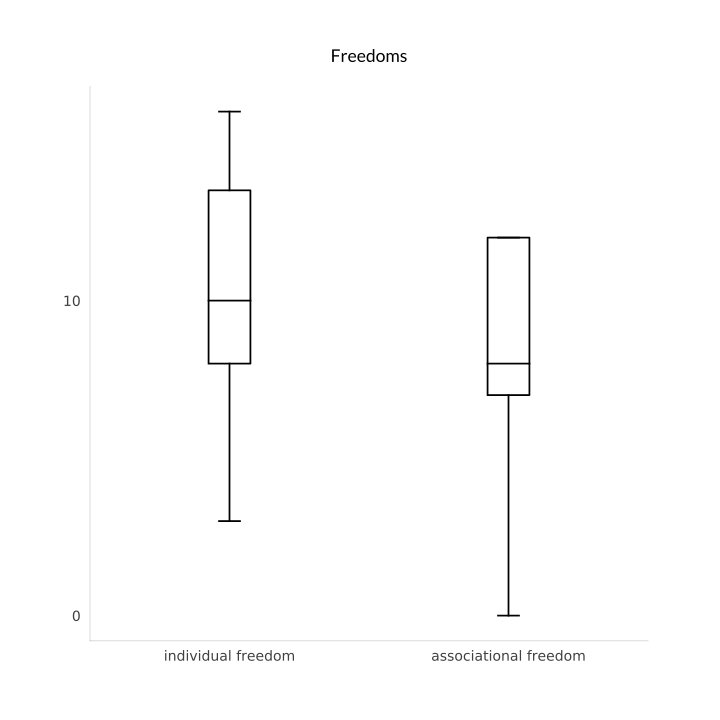
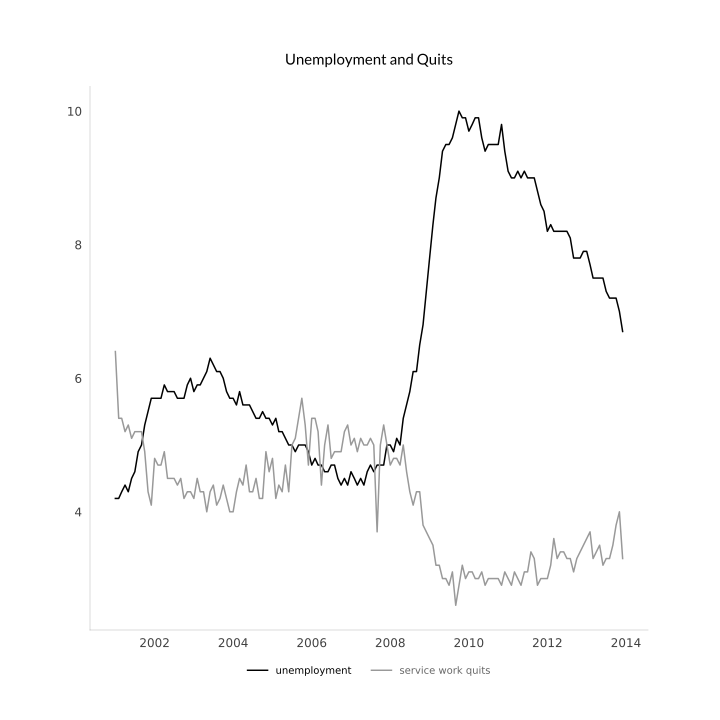

# Plottyprint

(TODO: convert this to reStructuredText, get image examples in, test a bit more, maybe tweak density option in hist and boxplot opts then pypi it up)

##The Goal

Make simple data visualizations in Python that are **easy**, **attractive**, and most importantly **appropriate for dead-tree printing** (like in academic journals, conference posters, or newspapers), with a bias toward greyscale in case color printing is expensive.

This very small library is targeted at the easiest 60% or so of plots that social scientists and student journalists and other light-to-moderate data users will want to produce. 

Right now, the amount of effort it takes to go from from no plots at all or really ugly plots to simple but attractive plots is *much* longer than the amount of effort from simple but attractive plots to really complex plots. This strikes me as unacceptable. If you want to produce a 4-d contour plot overlaid on a map of the world with color representing time, I can't help you. But if you want to produce a basic scatterplot, maybe with a least squares fit on top of it, and then slap it into your journal submission to impress the peer reviewers, I'm here for you. 

## The Challenges

1.  Default matplotlib plotting is ugly, and making attractive plots is difficult.

2.  There are many Python packages that make it easy create beautiful plots on top of matplotlib, such as [seaborn](https://seaborn.pydata.org), [bokeh](https://bokeh.pydata.org/en/latest/), and [plotly](https://plot.ly/python/) are my favorite examples, but the readme to [Altair](https://github.com/altair-viz/altair) lists numerous other excellent options.  However, these options are all built for web or interactive use, not for printing. They have lots of colors, default proportions appropriate for screen usage, and often interactive elements that don't make sense on paper.  While it's possibly to convince those libraries to make plots for print, it's a lot of work.  (If you want to do that, I recommend using the Python port of [ggplot](http://ggplot.yhathq.com).) 

## The Plottyprint Solution

This very small library aims to provide a handful of basic and attractive printable plots that will work out of the box with sensible defaults for the most simple use cases.  Right now, it supplies four workhorse plots: 

1.  A **scatterplot** between two variables. By default, the scatterplot has a least squares line through it, and a confidence region around that line, but this is easy to turn off.

2.  A **histogram** of one variable. If you want to get really fancy to impress the peer reviewers, you can stick a kernel density estimator line on top of it. 

3.  A **boxplot** with the standard frills (whiskers, notches, all that good stuff).

4.  A **time series plot** that gives you a line of one or two events over time. The time series plot is experimental, and might not work with your data; I'll try to improve it in subsequent versions.

This, obviously, represents the science communicator's basic toolkit for displaying the relationship between two variables, the shape of one variable, and the relationship between mean, interquartile range, and outliers for several variables, respectively.

Each of these elements is presented in high-contrast greyscale, and has all of matplotlib's default [chart junk](https://en.m.wikipedia.org/wiki/Chartjunk) ruthlessly ripped out. 

In this 0.1 release, there are only a handful of customization options, but over time I plan to add more plot types and add a bit more customization. Moreover, every plot returns a matplotlib figure, so if you know matplotlib you can always do your own customization after the fact. 

Here are some examples.  

Scatterplot, with fit line and confidence region. 

Histogram, no KDE estimator.

Histogram, with KDE estimator

Boxplot

Time Series

## Installation

`pip install plottyprint` 

[BUT NOT YET, ON PYPI SOON]

## Usage

There are three functions, each corresponding to a plot.  Each takes one or more numpy arrays, or anything that can be cast into a numpy array with `np.array()` without going wrong (lists, Pandas `DataFrame` columns, etc.), plus some configuration.

Each function returns a `PlottyFig` object. This is just a subclass of matplotlib.figure.Figure, with a handful of convenience methods (documented below) to tweak your plots after you create them and smooth out the rough edges of the matplotlib api. Because it's a figure subclass, those who know matplotlib can also dig in deeper to tweak to your heart's content. 

### Scatterplot

**scatterplot(x, y, title="", xlabel="", ylabel="", numticks=3, labelsize=15, dotsize=8, ylabel_wrapping=6, size=(10, 10), fit_line=True, confidence=True, alpha=0.05, font="Lato")**

- x and y are, obviously,  your data.

- title is, obviously, the title of the plot

- xlabel and ylabel are, obviously, the labels for your data.

- numticks is (wait for it) the number of ticks to show on each axis. For mysterious reasons, sometimes matplotlib likes to give you a little more or fewer than the number asked for, but at any rate the default is a nice small number that will show the scale of the data without overwhelming the reader with noise. 

- labelsize is the size of the axis labels. The title will be scaled up a little from this.

- dotsize is the size of the individual points in the plot.

- ylabel_wrapping is the number of characters in the y label before it wraps to another line. (Making y labels attractive is a bit difficult.)

- size is a tuple representing the size in inches

- fit_line is a boolean representing whether or not to put a least squares line in the plot.

- confidence is a boolean representing whether or not to put a confidence interval around the least squares line. Obviously, this won't do anything if you don't have a least squares line in there.

- alpha is the width of your confidence interval. The default represents the good old fashioned 95% interval.

- font is the name of the font for labels.

### Histogram

**histogram(variable, bins="auto", density = False, title="", numticks=5, labelsize=15, size=(10, 10), add_kde=False, kernel_param = 0.4, show_n = True, font="Lato")**

- variable is, obviously, your data.

- bins can be a number of bins, or "auto" to let numpy come up with something for you

- add_kde controls whether you want to slap a kernel density estimator plot on top of your histogram. If you do want to do this, it'll change the scale of the histogram: it will become probability density rather than counts, and, since the y label on a density histogram is anywhere between confusing and outright deceptive, it gets removed.  Call me paternalistic.

- kernel_param is a parameter that goes into the kernel density estimator. Scipy does [a lot of fancy math](https://docs.scipy.org/doc/scipy/reference/generated/scipy.stats.gaussian_kde.html) with this, but you can think of it as kind of similar to the bandwidth parameter in the [R kde function](https://stat.ethz.ch/R-manual/R-devel/library/stats/html/density.html).  For practical purposes, larger numers should produce smoother plots, but it's probably worth playing with interactively. 

- show_n is a boolean determining whether to have a y axis with the number of observations per bin or not. As noted above, this is automatically turned off if you add a kernel density estimator. 

Everything else is the same as in `scatterplot`.

### Boxplot

**boxplot(variables, labels, title="", numticks=3, labelsize=14, size=(10, 10), font="Lato")**

Everything here is the same as in `scatterplot` except that variables is a list of, well, variables (numpy arrays etc.), and labels is a list of labels.  You can put as many variables in here as you can squeeze in.

### Time Series

**timeseries(in_dates, events, labels = ["", ""], title="", numticks=3, labelsize=12, size=(10, 10), font="Lato", notch=True)**

- in_dates is an array (or list etc.) of `date` objects (from the standard Python datetime module). 

- events is a list of arrays of events. There can be a maximum of two---each of these will be plotted as a different line. (So, in_dates will be a column of your data, and events will be a list of one or two columns from your data.)

- labels is, like in boxplot, a list of labels for your events.

- notch is whether to put a notch in the boxes marking out a confidence interval around the median. Uses the matplotlib default, which isn't terribly clearly specified in [the documentation](https://matplotlib.org/api/_as_gen/matplotlib.pyplot.boxplot.html), but I assume (from the bootstrap parameter in there) is 95%.

Otherwise, the parameters are the same as above. However, you should note that numticks doesn't control the number of entries on the x axis (time). Messing with that is actually a terribly messy procedure, but the defaults seem to be working.

## Possible Glitches

- I created this with a recent Python 3 release.  I haven't tested it in Python 2, but I think it should work. If it breaks in Python 2 it's probably because I did something silly like rely on modern division or the latest fancy string formatting, file an issue and I'll fix it. 

- Fonts are a problem with matplotlib, and if you run into font difficulties then see [this blog post](http://andresabino.com/2015/08/18/fonts-and-matplotlib/) for a fix. I've set Lato as the font for everything because it's pretty and [on google fonts](https://fonts.google.com/specimen/Lato).

- I haven't quite sorted out timeseries date ranges yet. Right now it just uses the matplotlib defaults, and uses the ordinary plotting method rather than the `plot_date` method to generate (`plot_date` produces mysterious and bizarre results). A PR to make this a little nicer would be welcome.

### PlottyFig Object

As noted above, the PlottyFig object supplies several convenience methods, which can be called on any instance generated by this library (denoted `instance` below), including: 

**instance.get_main_plot()** returns the matplotlib Axes object containing the actual plot---this is where you do things like change the title, tweak borders, fonts, etc., or, for more advanced uses, overlay plots of extra data onto the existing axis and suchlike. 

**instance.change_title(title)** changes the title of an existing plot.
